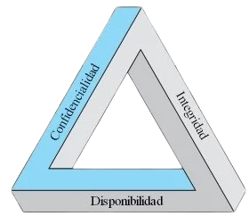

# SAD
Visita:   https://enriqueiborra.github.io/SAD/

En FP - CFGS - ASIR Módulo: 0378 - **Seguridad y Alta Disponibilidad**.

De acuerdo con el Real Decreto 1629/2009, de 30 de octubre, y actualizado en Real Decreto 500/2024, de 21 de mayo, 
por el que se establece el título de técnico superior en administración de sistemas informáticos en red y 
se fijan las enseñanzas mínimas, los resultados de aprendizaje son:
## Resultados de aprendizaje
1. Adopta pautas y prácticas de tratamiento seguro de la información, reconociendo las vulnerabilidades de un sistema informático y la necesidad de asegurarlo
2. Implanta mecanismos de seguridad activa, seleccionando y ejecutando contramedidas ante amenazas o ataques al sistema
3. Implanta técnicas seguras de acceso remoto a un sistema informático, interpretando y aplicando el plan de seguridad
4. Implanta cortafuegos para asegurar un sistema informático, analizando sus prestaciones y controlando el tráfico hacia la red interna.
5. Implanta servidores «proxy», aplicando criterios de configuración que garanticen el funcionamiento seguro del servicio.
6. Implanta soluciones de alta disponibilidad empleando técnicas de virtualización y configurando los entornos de prueba.
7. Reconoce la legislación y normativa sobre seguridad y protección de datos valorando su importancia.

